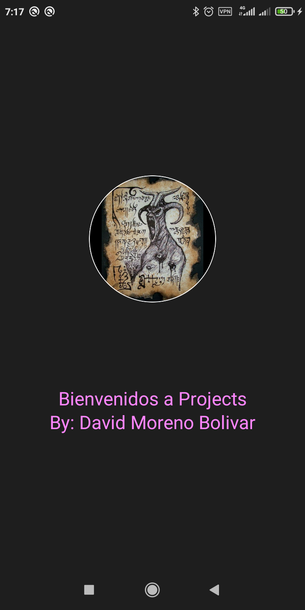
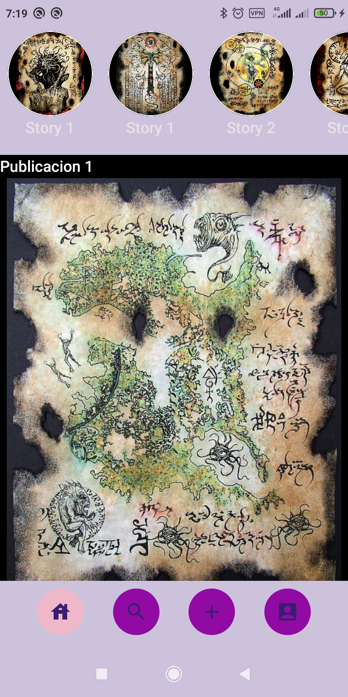
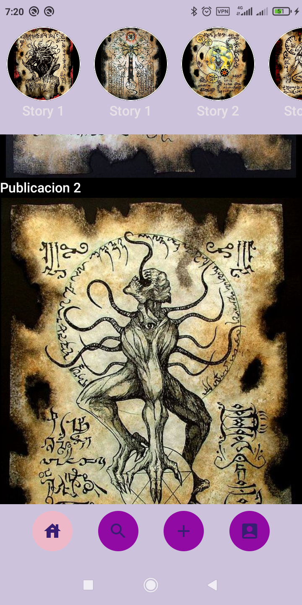

# Examen del primer parcial de Programacion MultiMedia (PMM)

## Enunciado

El enunciado del ejercicio pide generar una interfaz de usuario similar a la de instagram.

Se requiere una pantalla de carga  (splash screen), una pantalla principal y otra de usuario donde se muestra info. sobre este.

Se requiere navegacion entre pantallas por medio de botones y de forma automatica para la splash screen.

Se describen los detalles de cada pantalla en el pdf del enunciado (/ENUNCIADO/First Multimedia Programming and Mobile Devices exam.pdf
)

## Capturas del ejercicio resuelto

Vista de la pantalla de carga de la app.
<figure>
    
</figure>

Vistas de la pantalla principal donde se muestra una cabecera con varias imagenes redondas que se desplazan horizontalmente, mas abajo la parte principal de la app donde podemos deslizar las imagenes, y al pie de la imagen se muestra la barra de navegacion que nos permite ir a la pantalla de usuario.
<figure>
    
</figure>

<figure>
    
</figure>

Captura de la pantalla que muestra la informacion del usuario
<figure>
    
</figure>
